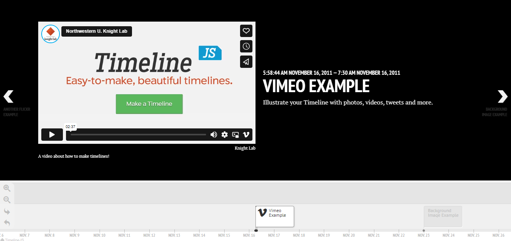
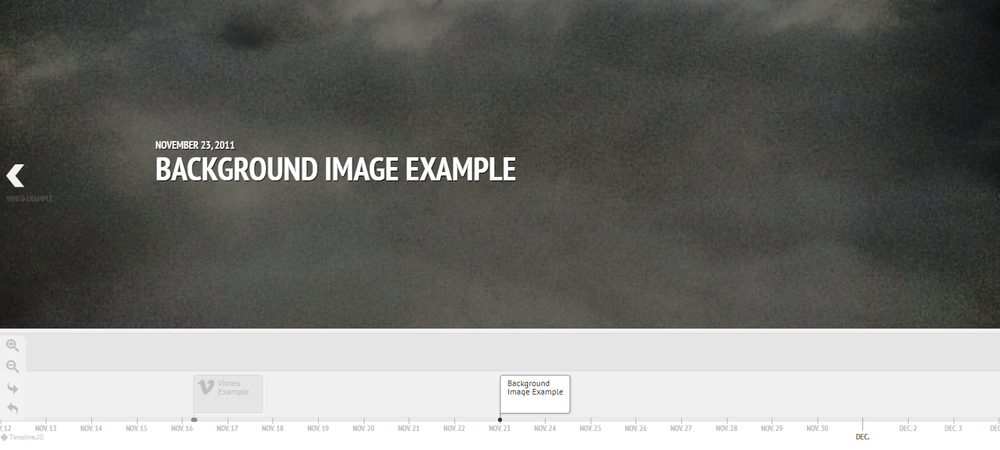
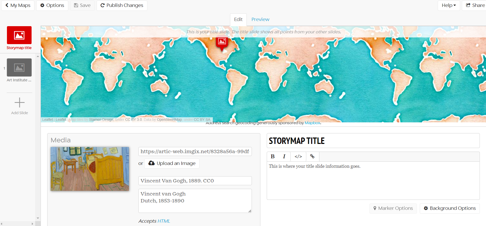
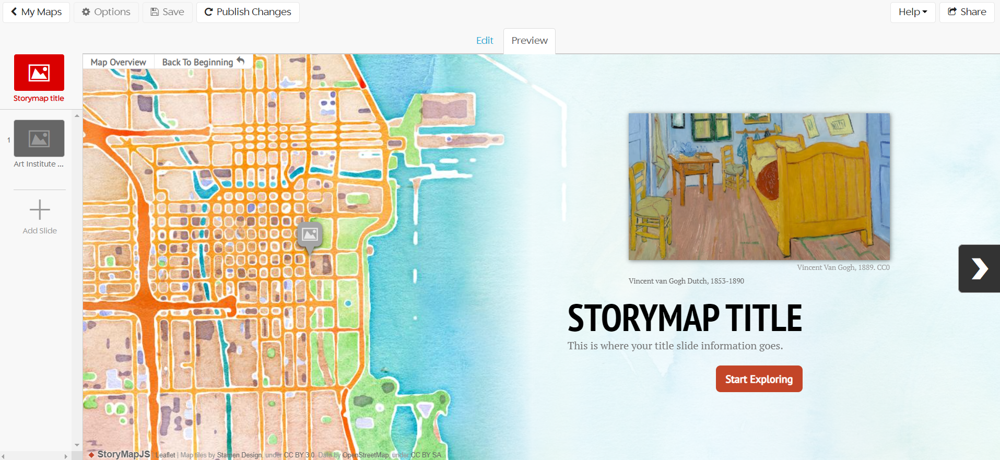

# Customizing Knightlab Tools
## Customizing TimelineJS
Once you've followed the steps to <a href="https://ubc-library-rc.github.io/digital-exhibits-survey/content/digital-storytelling-tools.html#timelinejs">set up and begin editing TimelineJS</a>, you can customize the look of the Timeline.
 
<aside class="note">
<strong>I have a spreadsheet, now what?</strong> Read through the pre-existing text that comes within the spreadsheet that Knightlab generates for you for a general overview of what each column represents. Once you enter your content, return to the Knightlab webpage and paste your spreadsheet URL to generate an iframe to embed your Timeline to your website.
</aside>

Your Timeline spreadsheet provides several columns to customize the look of your final product.
1. **Column L-O "Media"**: Entering an image link in column L will show a "featured image" on the left side of the Timeline entry. This can be an image or a video.

   
2. **Column R "Background"**: Entering an image link here will display it as the background for your Timeline entry.

For more information on customizing TimelineJS, read <a href="https://timeline.knightlab.com/docs/using-spreadsheets.html">Knightlab's Guide</a>.

## Customizing StoryMapJS
Once you've followed the steps to <a href="https://ubc-library-rc.github.io/digital-exhibits-survey/content/digital-storytelling-tools.html#storymapsjs">set up and begin editing StoryMapJS</a>, you can customize the look of the StoryMap.

## General StoryMap Customization
At the very top left of your StoryMap interface, there will be a button for "Options". 

Clicking on the "Options" button will open a pop-up menu with two tabs. Below is what they each allow you to do.
1. **"Display" tab**: customizing the look of the StoryMap itself, rather than the individual slides and their contents.
2. **"Share" tab**: open the sharing options, which we will explore in <a href="https://ubc-library-rc.github.io/digital-exhibits-survey/content/knightlab-customization.html#sharing-customization">Sharing Customization</a>.

<aside class="note">
<strong>Can't click on the "Options" button?</strong> Check if you are on the "editing" tab or "preview" tab at the center-top of you StoryMap interface. <u>You have to be in the editing tab to click on the "Options" button.</u>
</aside>

## Display Customization
1. **StoryMap Size**: This allows you to specify the dimensions of the StoryMap that you share. You can also edit this in the "Share" settings.
2. **Language**: This will set the language of the navigation buttons your completed StoryMap. 
3. **Fonts**: This will determine the fonts used for your StoryMap titles and text boxes. Each font option offers a pair of fonts, the first one is for the titles, the latter for the text boxes.
4. **Language**: Use this to change the language setting for the navigational buttons at the top left of the StoryMap, where it would say "Map Overview" and "Back To Beginning."
5. **Treat as Cartography or Image**: In the vast majority of cases, this will be set to Cartography. For those interested in using StoryMap to create a tour of an image, you can read <a href="https://storymap.knightlab.com/gigapixel/">Knightlab's guide to StoryMap for Images</a>.
6. **Call to Action**: Selecting "yes" will give you a button on the title slide which will read "start exploring" by default. You can edit this text, or select "no" to remove the button (though we recommend keeping it).
7. **Map Type**: This will allow you to select either one of the preset Stamen Maps in various colors or upload/link to a custom map or image.

## Customizing Slides
The interface provides an **editing tab and a preview tab at the top-center of the screen**.

### Editing View
You will see that your editing view is split into several sections. A <u>slide overview</u> on the left, a <u>map view</u> at the center, and below the map, a <u>media menu</u> on the left and a <u>text menu</u> on the right.

### Preview View
Switch to this view to review your layout and text.

### Title Slide
The title slide does not allow you to edit the map, as this map will be populated with all of the geographical points from your other slides.

### Inserting Media into Slides
You can either have an image display as <u>a featured image</u> or a <u>background image</u>.
1. **A featured image** will appear above the slide's heading text, and will have a white background unless altered. To create a featured image, use the media menu to upload or URL to the image you want, and provide an attribution and caption.
2. **A background image** will appear as the backdrop for your heading text and content text. To create a background image, click on the "Background Options" button below the text menu and either upload an image or provide a URL for your image.

### Other Customization Options
1. **Background color**: you can also change the background color of your featured image and text in the "Background Options" button. Simply copy and paste a Hex code or select a color from the color spectrum.
2. **Map markers**: you can upload custom map markers for your plotted points by uploading an image in the "Marker Options" button. Choose your file from your device and click "Upload" - once it has been successfully uploaded to StoryMap, it will appear in the dropdown menu directly above the "Choose File" button.

<aside class="note">
 <strong>Be sure to click "Save" and "Publish Changes" at the top left once you're done!</strong>
 </aside>

## Sharing Customization
Once your StoryMap is ready, click on the "Share" button in the top right. (You can also open the "Settings" tab at the top left and select the "Sharing" tab to open the share settings.)

Once there, you will find:
1. a URL that you can share in various social media platforms
2. an options to add a description
3. an option to add a featured image
4. an option for embedding your StoryMap into other websites, such as Wordpress or Scalar (You can change the dimensions for the embed below the iframe code - be sure to copy the iframe code <u>after</u> you edit the dimensions. You can also edit the width and height in the iframe code yourself.)
5. an option to export the StoryMap package (all of its images, map markers, etc.) to another user's account or another server.

All of these options allow you to customize StoryMapJS to suit your needs!
<iframe src="https://uploads.knightlab.com/storymapjs/d31a5d91aae4442a404ed21a6ca6945b/new/index.html" frameborder="0" width="100%" height="800" alt="an example storymap that demonstrates the customization options"></iframe>
  

