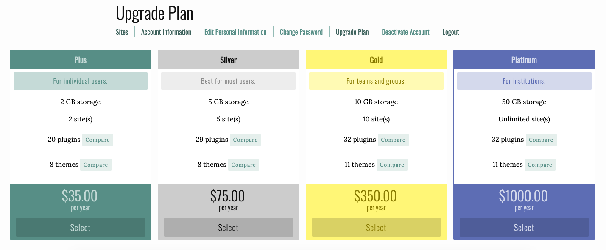

## What is Omeka?

[“Omeka”](https://omeka.org/about/project/) is a Swahili word meaning “to display or lay out wares”. Developed by the Roy Rosenzweig Center for History and New Media at George Mason University, Omeka is a free, open source publishing tool, or content management system, that allows you to curate digital collections and make a searchable database. There are currently three instances of Omeka including Omeka.org, Omeka.net, and Omeka S.

### Omeka.org vs. Omeka.net vs. Omeka S

Omega.org needs to be hosted on a web hosting server. It is free and highly customizable but requires more expertise to build.

Omeka S was created for institutions to manage multiple sites.

Omeka.net is hosted on Omeka servers. It is easier to use but it is less customizable. Omeka.net offers a tiered, paid subscription as well as a free trial version. The trial version allows you to build 1 site, with 500 MB of storage space. It has very limited plugins or aesthetic features but it’s a great starting point for beginners and learning how to use Omeka.

### Upgrading your Omeka.net account

Omeka.net has a tiered, paid subscription service. You can upgrade your plan at any time.

